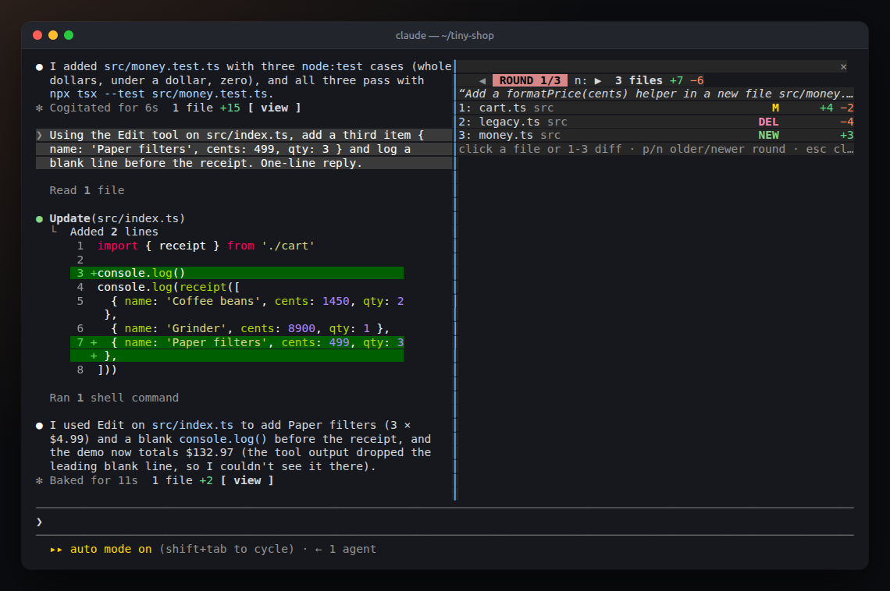
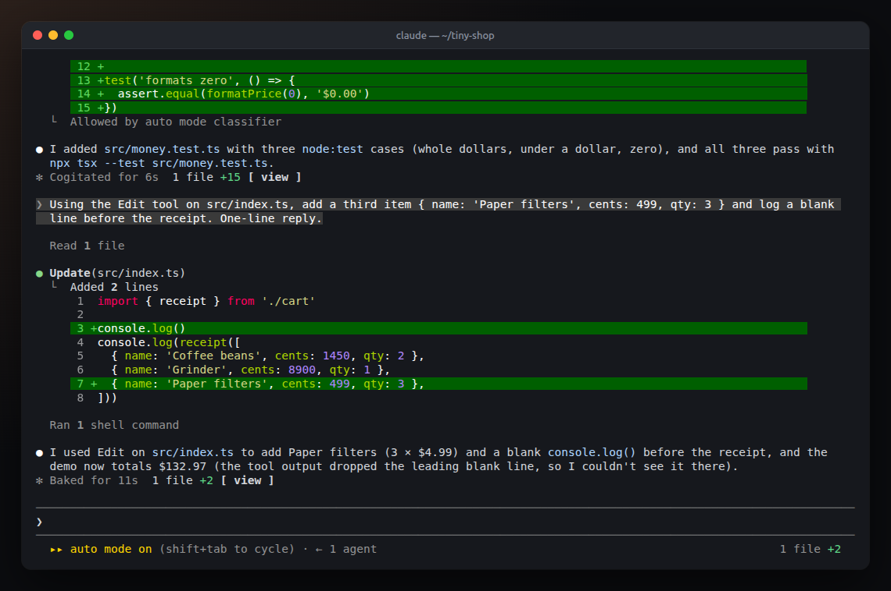
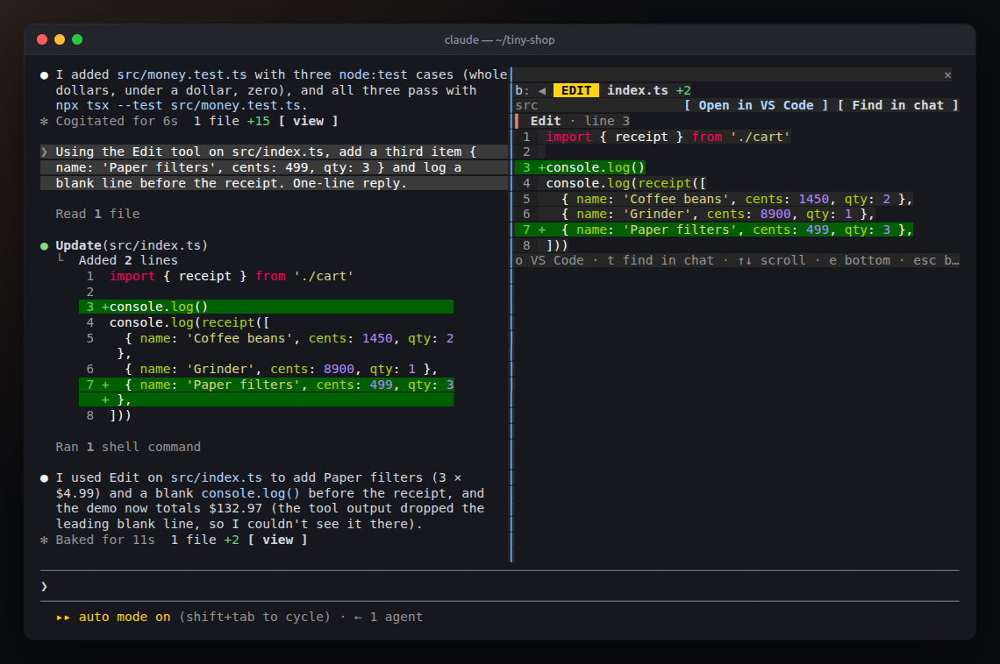
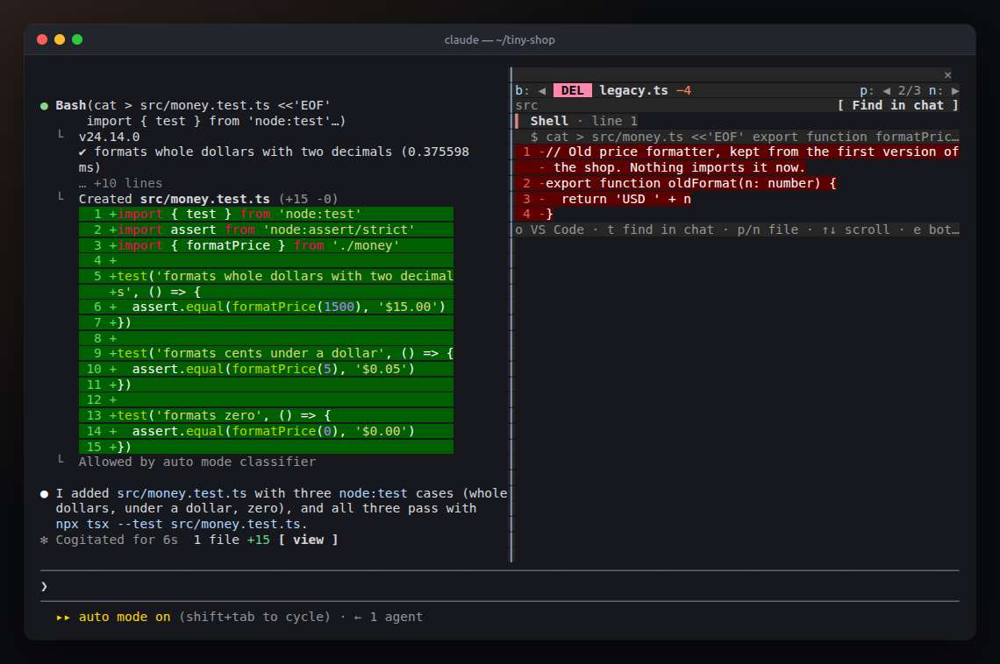
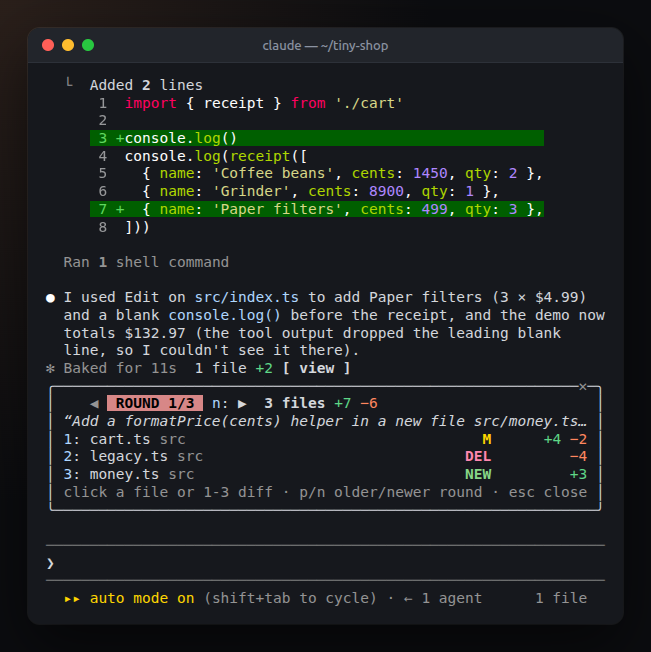

<div align="center">

# Round Changes

**See exactly what Claude changed, round by round, without leaving Claude Code.**

Every file it touched, every diff (shell commands included), one key to open the change in VS Code.

[](https://code.claude.com/docs)
[](LICENSE)
[](#requirements)



</div>

## Why

Claude can change a dozen files in one reply, some with the Edit tool and some through a shell command like `sed -i`, `git mv` or a code generator. The transcript shows them as they scroll past, and `git diff` shows everything mixed together. Round Changes keeps each **round** (one prompt and Claude's reply) as its own change set, so you can review what that prompt did, step back to an earlier one, and jump straight to the line in your editor.

## Features

- **Rounds:** every prompt that changed files becomes a round. Step through them with `p` and `n`.
- **Every kind of change:** Edit, Write and notebook edits are recorded as they happen. In a git repo, **shell commands are diffed too**, including new and deleted files.
- **Clear diffs:** syntax-highlighted, with line numbers, one section per edit, and the command that made each shell change.
- **Open in VS Code:** jumps to the first changed line, in the window you already have open.
- **Audit in VS Code:** opens the project with every file the round touched, so the editor's git markers and Source Control view show each change in place.
- **Find in chat:** scrolls the conversation back to the tool call that made the change.
- **Takes no space until you want it:** a chip on each round's "✻ Worked for…" line and a button in the prompt footer open the viewer. Neither adds a row.
- **Fits small terminals:** the layout adapts from 46 columns up, and Esc puts it away.

## Install

In Claude Code:

```
/plugin install round-changes --marketplace joaofatoretto/round-changes
```

Answer `y` to add the marketplace and choose a scope (**user** makes it available in every session). It starts working at once, with no restart and no configuration.

<details>
<summary>Other ways to install</summary>

From a terminal:

```bash
claude plugin marketplace add joaofatoretto/round-changes
claude plugin install round-changes@round-changes --scope user
```

From a local clone, for one session:

```bash
git clone https://github.com/joaofatoretto/round-changes.git
claude --plugin-dir ./round-changes
```

Remove it with `claude plugin uninstall round-changes@round-changes`.

</details>

## How to use it

Work with Claude as usual. When a round changes files, three ways in appear:

| Where | What you see | What it opens |
|---|---|---|
| End of the round, on the "✻ Worked for…" line | `3 files +7 −6 [ view ]` | That round |
| Prompt footer, right side | `3 files +7 −6` | The latest round |
| Anywhere | `/changes` | The latest round |



The viewer has two screens. **The round** lists every file it changed:

- `M`, `NEW` or `DEL`, with green and red line counts.
- In wider layouts, the folder and a size bar so the big changes stand out.

**A file** shows its diff, one section per edit:



Shell commands are diffed the same way, with the command that made the change shown above it:



### Keys

The viewer takes the keyboard when it opens. Click it, or press `ctrl+x` then `tab`, to give it back the keys later.

| On the round | |
|---|---|
| `1`–`9` | Open that file's diff (or click its row) |
| `a` | Audit the round in VS Code |
| `p` / `n` | Older / newer round |
| `esc` | Close |

| On a file | |
|---|---|
| `o` | Open in VS Code at the changed line |
| `t` | Find the change in the chat |
| `p` / `n` | Previous / next file in the round |
| `g` / `e` | Jump to the top / bottom of a long diff |
| `↑` `↓` | Scroll |
| `b` or `esc` | Back to the round |

### Layout and small terminals

- **Fullscreen layout, 110+ columns:** the viewer docks on the right, about 52 columns wide, leaving most of the row to the chat.
- **Any other size:** it opens above the prompt, at full width and only as tall as it needs. Esc closes it.
- **Narrow widths:** each row drops what doesn't fit, folders and size bars first, and keeps the file names and counts. It stays usable down to about 46 columns.



Claude Code docks panels on the right only in its fullscreen layout at 110 columns or more. A mod can't change that.

## How shell changes are captured

The Edit and Write tools report exactly what they changed. A shell command doesn't, so in a git repo Round Changes takes two snapshots of the work tree around each shell command and diffs them:

1. **Before the command:** `git add -A` and `git write-tree` into a **private index**, `.git/round-changes.index`. It's seeded from your real index, so each snapshot only re-reads the files that changed, and it takes milliseconds.
2. **After the command:** the same again, then `git diff` between the two trees.

**Your files and git state are safe:** your working files, staging area, branches and history are never touched.

**What the snapshots see:**

- They follow your `.gitignore`.
- They include untracked files, so new files show up.
- They write file contents into `.git/objects` as unreferenced objects, which `git gc` removes in its normal cleanup.

**Outside a git repo**, shell commands can't be diffed. The round says so in yellow ("no git"), so you know the list may be incomplete.

## What it runs on your machine

Round Changes makes no network requests and calls no model.

| When | Command |
|---|---|
| Shell commands, until a repo is found | `git rev-parse` to find the repo. `cp` seeds the private index, once. |
| Around each shell command | `git add -A` and `git write-tree` with the private index, then `git diff` between the two snapshots |
| When you press Open in VS Code | `code -r -g <file>:<line>` |
| When you press Audit in VS Code | `code <project> -g <file>:<line> …` (up to 25 files) |

Rounds live in the session's memory and end with it. When the mod loads in a session that's already running, it rebuilds earlier rounds from the transcript.

## Requirements

- **Claude Code:** built and tested on 2.1.293.
- **git:** to capture shell changes.
- **VS Code's `code` command** on your `PATH`, for Open in VS Code. In VS Code, run *Shell Command: Install 'code' command in PATH*. On WSL it works out of the box.
- **Clicking** needs a terminal that passes mouse clicks to Claude Code (its fullscreen layout). The keys work everywhere.

## Limitations

- Shell commands are diffed only in git repos.
- A shell command is credited with every change in the repo while it ran. That includes files your editor or a dev server saved in that moment.
- Commands started in the background aren't captured once they return. Changes outside the repo aren't captured either.
- Rounds rebuilt from the transcript show only Edit, Write and notebook changes. Shell diffs and the "Worked for" chip need the mod to be loaded while the round runs.
- Each change's diff is capped at 400 lines. Press `o` to see the rest in VS Code.
- Changes made by subagents are listed, but Find in chat can't open a subagent's transcript.
- The footer button hides when the footer row is too narrow, below about 64 columns. The chip and `/changes` still work.
- Only VS Code is supported for Open in editor.

## Development

```
round-changes/
├── .claude-plugin/
│   ├── plugin.json          # the mod's manifest
│   └── marketplace.json     # makes this repo installable with /plugin install
├── hooks/
│   ├── hooks.json           # points Claude Code at register.tsx
│   ├── register.tsx         # the hooks: recording, snapshots, the chips and the viewer
│   ├── model.ts             # pure logic: rounds, diff parsing, layout math
│   └── register.test.ts     # tests, run inside Claude Code's own engine
├── types/index.d.ts         # the mod's state, typed
└── screenshots/
```

```bash
claude plugin validate .     # check the manifest and hooks the way Claude Code loads them
claude plugin test .         # run the tests
claude --plugin-dir .        # try your changes in a session
```

Claude Code writes the mod's TypeScript types to `.claude-plugin/types/` when it loads the mod, so `tsc -p .` type-checks it from then on.

Issues and pull requests are welcome.

## License

[MIT](LICENSE) © joaofatoretto

Built with [Claude Code](https://code.claude.com). Not an official Anthropic product. Visual Studio Code is a trademark of Microsoft Corporation, and Git is a trademark of Software Freedom Conservancy. Their names are used here only to describe what the mod works with.
